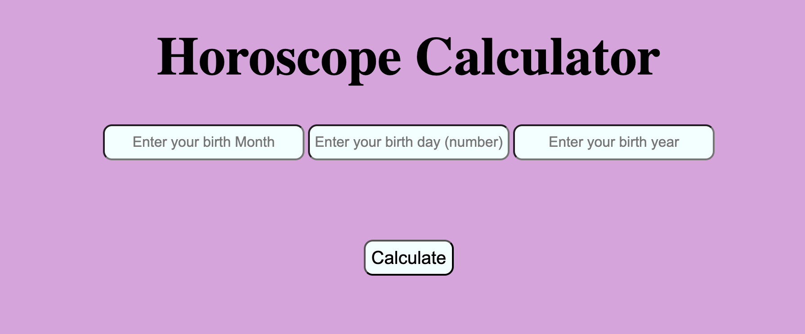

# Horoscope Calculator

A simple web application that determines your zodiac sign based on your birth date. Built with vanilla HTML, CSS, and JavaScript.

## Features

- Clean, user-friendly interface with a purple theme
- Input validation for birth month and day
- Accurate zodiac sign calculation based on traditional astrological dates
- Responsive design with centered layout
- Large, prominent display of results

## How It Works

The application takes three inputs:
- **Birth Month**: Enter the full month name (e.g., "January", "February")
- **Birth Day**: Enter the numerical day (1-31)
- **Birth Year**: Enter the year (currently for reference only)
- ## 📸 Demo


After clicking "Calculate", the app determines your zodiac sign using the traditional date ranges:

| Zodiac Sign | Date Range |
|-------------|------------|
| Capricorn | December 22 - January 19 |
| Aquarius | January 20 - February 18 |
| Pisces | February 19 - March 20 |
| Aries | March 21 - April 19 |
| Taurus | April 20 - May 20 |
| Gemini | May 21 - June 21 |
| Cancer | June 22 - July 22 |
| Leo | July 23 - August 22 |
| Virgo | August 23 - September 22 |
| Libra | September 23 - October 23 |
| Scorpio | October 24 - November 21 |
| Sagittarius | November 22 - December 21 |

## File Structure

```
horoscope-calculator/
├── index.html          # Main HTML structure
├── css/
│   └── style.css       # Styling and layout
├── images/
│   └── demo.png       # image of the demo
├── js/
│   └── main.js         # JavaScript logic
└── README.md           # This file
```

## Installation & Usage

1. **Clone or download** the project files
2. **Open** `index.html` in any modern web browser
3. **Enter** your birth month (full name, case-insensitive)
4. **Enter** your birth day as a number
5. **Enter** your birth year
6. **Click** the "Calculate" button
7. **View** your zodiac sign displayed below

## Technical Details

### HTML Structure
- Semantic form elements for user input
- Three text input fields with descriptive placeholders
- Button to trigger calculation
- Heading element to display results

### CSS Features
- Flexbox layout for responsive centering
- Custom color scheme with plum background and azure inputs
- Rounded corners and consistent spacing
- Large, readable typography

### JavaScript Logic
- Event-driven architecture using `addEventListener`
- Switch statement for month-based logic
- Ternary operators for date range comparisons
- Case-insensitive month input handling
- Direct DOM manipulation for result display

## Browser Compatibility

Works in all modern browsers including:
- Chrome
- Firefox
- Safari
- Edge

## Future Enhancements

Potential improvements could include:
- Input validation and error handling
- Dropdown menus for month selection
- Date picker integration
- Horoscope descriptions for each sign
- Mobile-optimized responsive design
- Accessibility improvements (ARIA labels, keyboard navigation)

## Contributing

Feel free to fork this project and submit pull requests for improvements or bug fixes.

## License

This project is open source and available under the MIT License.
